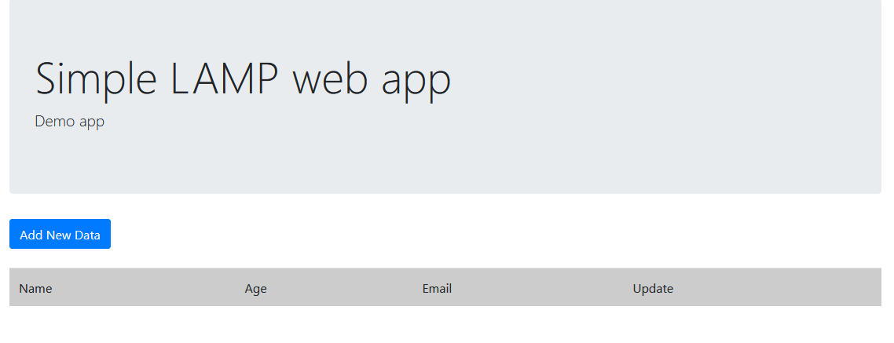
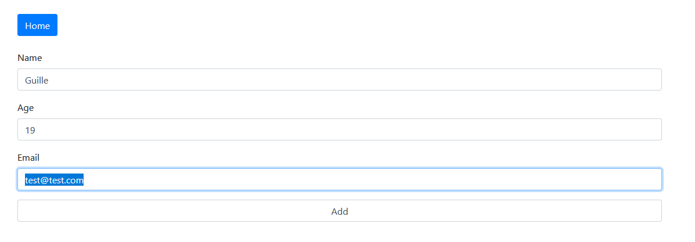

# Implantación de una aplicación web LAMP en AWS

## Instancia EC2 con Ubuntu  

   

       

# Índice

### [1. Introducción](#introducción)

### [2. Explicación del script](#explicación-del-script)

### [3. Conclusión](#conclusión)

       

# Introducción
Esta práctica se basa en la máquina de Ubuntu en EC2 que lanzamos en la **[práctica 1](https://github.com/drain113/iaw-practica-01)**.

El objetivo es instalar una aplicación web ya programada por [Jose Juan](https://github.com/josejuansanchez/iaw-practica-lamp) junto a una base de datos gracias a la estructura proporcionada por la anterior práctica, la pila LAMP.

       

# Explicación del script 

El script **deploy.sh** clonará el repositorio de Jose Juán y lo moverá a /www/var/html , cambiando sus permisos para  que se ejecute correctamente.
Para más información leer comentarios del script.

Esto hará que tengamos un index.html en el que podremos introducir datos que se guardarán en la base de datos.

       

# Conclusión 

Este entorno LAMP es una manera sencilla de empezar grandes cosas.

Manejarse por el entorno de máquinas en la nube de AWS puede parecer tedioso al principio pero es un entorno agradable para el usuario con el que administrar distinas máquinas al mismo.   

<break> </break>

-Guille  
<break>   </break>  
 
